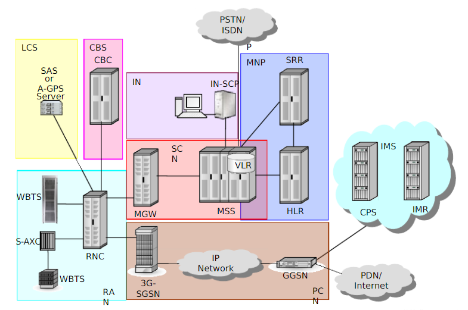
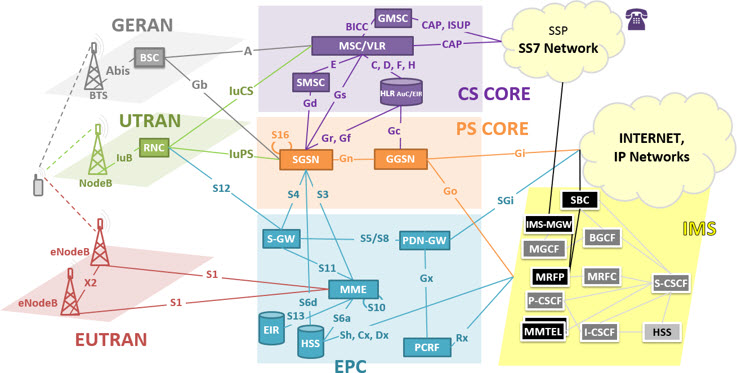
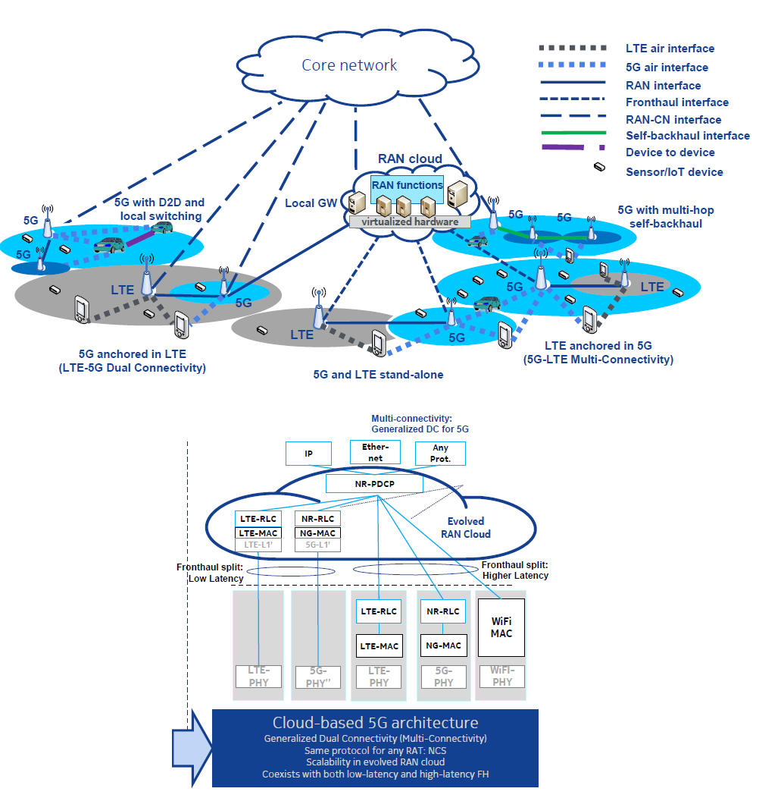

.. _ref.mobnet:

============================
#Ref.4 モバイルネットワーク
============================

3Gネットワーク
=================

第3世代移動通信システム
-----------------------------

3Gネットワークは主にcurcit netがメインで、電話通信を使うことが多いです。

モバイルネットワークもありますが、品質と便利性はまだです。

ネットワークのメイン技術からは、通称 **RNC** です。

基地局は「NodeB」って呼ばれます。

構造
------

OSS
------

OSSとしての部分は全てのハードウェアをNetAct(Nokia Solution)に接続し、アラームを監視することです。

それから、色んなプラットフォームからやＮＥ（繋がった設備）からの問題を発見、もはや解決します。

技術によって、RANの直接的な接続が無理なので、OMSという設備が必要で、管理と監視が可能になります。

RANはWBTSやBTSと呼ばれます。

4Gネットワーク
=================

第4世代移動通信システム
-----------------------------

4Gネットワークは3Gの技術を上に、モバイルネットワークをもっとアップグレードでの技術を使います。

あとは最も3GでのRNC構造を効率的に改良で、 **LTE** の技術を発明する。

他には、音声をcercitじゃなくて、ネットで音声電話の技術を発展する。
それがVoLTE、もはやVoWiFiです。

基地局は「eNodeB」って呼ばれます。

構造
--------------

* PS.ピュア環境はサービスを提供としては不可能です。　この構造の中に実際な技術は「GERAN=2G,UTRAN=3G,EUTRAN=4G」です。

OSS
------

OSSとしての部分は全てのハードウェアをNetAct(Nokia Solution)に接続し、アラームを監視することです。

それから、色んなプラットフォームからやＮＥ（繋がった設備）からの問題を発見、もはや解決します。

技術によって、RANの直接的な接続が無理なので、iOMSという設備が必要で、管理と監視が可能になります。

RANはMRBTSと呼ばれます。

5Gネットワーク
=================

第5世代移動通信システム
-----------------------------

5Gネットワークは全てを違うの次元で始めます、スマホだけではなく、IoTデバイスの接続も考えます。

主にはクラウドサービスに応用します。OpenStackとしてクラウドプラットフォームを立てます。

構造はEdge CloudとCore Cloudで立ち上がります。すべての機能はクラウドにdocker containerとして働いてます。

基地局は「gNodeB」って呼ばれます。

基地局の詳細
----------------

周波数の理想な発展は三つの種類があります。

* 長いのは範囲の大きさを想定で使えます。
* 中型のは今までと似ているなネットワーク通信使いをやります。
* 短いのはデータのダウロード／アップロードスビートの速さとして狙います。

構造
--------------

応用
----------------

.. image:: https://i.imgur.com/e1dg7MS.png

クラウド概念
=================

OpenStackや、Docker Containerや、マイクロサービスというクラウド原生なサービスについてを整理します。

OpenStack
-------------------

OpenStackはOpen SourceのクラウドOSです。こちらで `公式サイト`_ でアクセスできます。

メインの構造はController NodeとCompute Nodeです。　全てを計算、ストレージと管理をすべで繋がります。

OpenStackの基礎はLinuxシステムが必要です。その上から、OpenStackツールと、様なプロジェクトをインストールして、立ち上げます。

最低限は内部API用のKeynote、Web制御のHorizon、ネットワークのNeutron、計算（VM）用のNovaとストレージのSwiftが必要です。

構造
^^^^^^^^^^^^^^

基本コンセプトは公式からの図で表示します。

.. image:: https://www.openstack.org/assets/openstack-map/openstack-map-v20190601.svg

仕込み・インストール
^^^^^^^^^^^^^^^^^^^^^^^^^^^^^

最低限なお勧めは2台のPCやVMがお勧めです。　公式サイトからのお勧めは以下のハードウェアが必要です。

* Controller Node　ｘ１台:

  * プロセッサー：　1個
  * メモリー：　4 GB
  * ストレージ（利用可能）：　5 GB

* Compute Node　ｘ１台:

  * プロセッサー：　1個
  * メモリー：　2 GB
  * ストレージ（利用可能）：　10 GB

OSシステムの基本は、Linuxが必要です、お勧めの選ぶは以下となります。

* お試し：

  * Ubuntu

* 実際応用：

  * CentOS/RHEL
  * Fedora

**手順：**

#. 事前準備（OSインストール、hosts、基本ネットワーク設置、openstackclientとselinux）
#. 依存性パッケージ（MariaDB、RabbitMQ、memcached、etcd）
#. `Keystone`_ ・OpenStack身分認証サービス
#. `Glance`_ ・イメージ保存の場所
#. `Nova`_ ・OpenStackの計算
#. `Neutron`_ ・OpenStackの中に使うネットワークサービス
#. （他） `Horizon`_ ・ダッシュボード、おすすめです

+--------------------------------------------------+
|  構造                                            |
+---------------------------+------------+---------+
| プロジェクト              | Controller | Compute |
+===========================+============+=========+
| Keystone  service(api)    |     o      |         |
+---------------------------+------------+---------+
| Glance api                |     o      |         |
+---------------------------+------------+---------+
| Glance registry           |     o      |         |
+---------------------------+------------+---------+
| Nova api                  |     o      |         |
+---------------------------+------------+---------+
| Nova conductor            |     o      |         |
+---------------------------+------------+---------+
| Nova compute              |     o      |    o    |
+---------------------------+------------+---------+
| Nova metadata service     |     o      |         |
+---------------------------+------------+---------+
| Nova novncproxy           |     o      |         |
+---------------------------+------------+---------+
| Nova placement api        |     o      |         |
+---------------------------+------------+---------+
| Nova scheduler            |     o      |         |
+---------------------------+------------+---------+
| neutron server(api)       |     o      |         |
+---------------------------+------------+---------+
| neutron dhcp agent        |     o      |         |
+---------------------------+------------+---------+
| neutron metadata agent    |     o      |         |
+---------------------------+------------+---------+
| neutron l3 agent          |     o      |         |
+---------------------------+------------+---------+
| neutron openvswitch agent |     o      |    o    |
+---------------------------+------------+---------+
| Horizon                   |     o      |         |
+---------------------------+------------+---------+
| *場合によって変更や追加可能です。                |
+--------------------------------------------------+

**構造図：**

.. image:: https://i.imgur.com/OSuTHTl.png

Docker Container
-----------------------

DockerとContainerは二つ違うのソフトウェア/技術です。　でもお互いで一緒に応用すると、良いな結果が出てきます。

この二つを組み合わせの目的はシステムとアップリケ―ションを軽量化、そうしたら応用の立ち上がりが早くなる。

この技術を使っているクラウドは、大量デプロイを可能になった。そうして更新と替えることがとても便利になった。

Containerの概念はLinux Kernalを元のシステムを使って、独立しようの事です。だからDockerはイメージとして、軽量化を可能になります。

このすべての実行も、一部がHostの借りるで動作しているから、速いなデプロイを実現する。

以下は、Dockerを使用も、イメージの作り方も簡単な紹介する。

*PS現在はWindowsのdocker containerも実現できます。

Dockerのインストール
^^^^^^^^^^^^^^^^^^^^^^^^^^^^^^

WindowsやmacOSの環境を使っていますの方は、 `docker公式サイト`_ からダウンロードとインストールがお勧めです。

Linuxの環境は、もう既にオリジナルなリポジトリがありますので、プラットフォームによって、以下のコマンドからインストール可能です。

``sudo apt-get install docker-ce docker-ce-cli containerd.io``
``sudo yum install docker-ce docker-ce-cli containerd.io``
``sudo dnf install docker-ce docker-ce-cli containerd.io``

まだ、 `ここから`_ も参考可能です。

Dockerを使う
^^^^^^^^^^^^^^^^^^^^^^^^^^^^^^^

`Base image`_ は公式サイトから検索可能です。　**★無料アカウントを作成は必要です**

``docker pull <リポジトリ[:latest]>``　リポジトリのイメージをローカルにダウンロードする。デフォルトのVer.は最新(latest)です、定義可能です。

``docker images``　ローカルのイメージを確認する。

``docker run [OPTIONS] IMAGE [COMMAND] [ARG...]``　Dockerイメージを実行（実体化）する。Containerは今から立ち上がります。　`もっと説明`_ は公式サイトへ。

``docker ps [-a]`` 実行していますのContainerを表示されます。 **-a**　は実行していないのも出ます。

``docker exec [OPTIONS] CONTAINER COMMAND [ARG...]``　docker　container内にコマンドを実行可能です。　`詳細は`_ 公式へ。

``docker attach <container_id>`` 実際にContainerの中にを接続する。(sshと似ています。)

``docker stop container_id``　Containerを不要（停止）する。

``docker rm [OPTIONS] CONTAINER [CONTAINER...]``　Containerを削除する。

Dockerイメージを作る
^^^^^^^^^^^^^^^^^^^^^^^^^^^^^^^^^^

ますは、Base Imageを確認するが必要です。

それから、Dockerfileを作ります。

*>Dockerfile　↓*

::

  FROM navidonskis/nginx-php7.1:latest
  RUN rm -rf /var/www
  RUN git clone https://github.com/hpcslag/aws-compt-web.git /var/www
  RUN cd /var/www;git pull

ファイルの中に、``FROM``は如何なBase Imageを使うのを指定する。　それから、``RUN``は、コマンドを追加実行する。

ファイルを完成したと、同じところで次のコマンドを実行する。

``docker build -t <your_username>/<repo-name> .`` **.**は今（Dockerfileいる）の場所です。 **-t　の後ろ**はdockerアカウントとプロジェクトを付けたい名前です。

上のコマンドを実行したら、ローカルでイメージを作ります。　そうして、``docker image`` で表示します。

もし、この作ったimageを試したいなら、 ``docker run <your_username>/<repo-name>``　って試運転可能です。

最後、もし他のCommunityの人とシェアしたいなら、次のコマンドを実行し、Docker Hubへアップロードする。

``docker push <your_username>/<repo-name>``

成功なら、こうな感じの画面が出ます。

.. image:: https://docs.docker.com/docker-hub/images/index-terminal-2019.png

そうして、ログインしたの `Docker Hub サイト`_ も表示します。

マイクロサービス
--------------------------

マイクロサービスの概念は、システムやアプリケーションをパーツにする。

マイクロサービスの中にはAPIがあります、他のマイクロサービスを使うために存在する。

新しい問題への対応や新機能の追加を迅速になるということです。

現世代の速さな変化を対応出来ますの開発方法です。

他の応用は、アプリケーションのシステムを全てdocker化に一気に開発が難しい事です。
効率として段階的に変換なら、大体まずマイクロサービス化に進めます。その最後はそのマイクロサービスをdokcerイメージに変換する。

おすすめの使え方は **Go** とか、 **Python** や **Purl** などの言語で開発がおすすめです。

.. _公式サイト: https://www.openstack.org/
.. _Keystone: https://docs.openstack.org/keystone/latest/
.. _Glance: https://docs.openstack.org/glance/latest/
.. _Nova: https://docs.openstack.org/nova/latest/
.. _Neutron: https://docs.openstack.org/neutron/latest/
.. _Horizon: https://docs.openstack.org/horizon/latest/
.. _docker公式サイト: https://www.docker.com/products/docker-desktop
.. _ここから: https://docs.docker.com/engine/install/
.. _Base image: https://hub.docker.com/search?q=&type=image
.. _もっと説明: https://docs.docker.com/engine/reference/commandline/run/
.. _詳細は: https://docs.docker.com/engine/reference/commandline/exec/
.. _Docker Hub サイト: https://hub.docker.com/?ref=login