.. _ref.os:

=======================================
#Ref.1 オペレーティング・システム（OS）
=======================================

Windows
============

最初接触したのシステム。初見としてはなんにも知らなかった。

内蔵のゲーム、マインスイーパーあんまり好きじゃない、逆にピンポールにハマった。

Windows 95はほぼ子供時代の思い。

今はこれらのがMicrosoft社作ったソフトウェアとシステムという事が知った。

これからは雑談より、技術面のメモです。

簡単ヴァージョン紹介
------------------------

いかは知るの部分で今までのシステムの簡単紹介。

+----------------+------------------------------+-----------------------------------------------------------------+
| システム       | 俺の時代                     | リマーク                                                        |
+================+==============================+=================================================================+
| Windows 98     | 子供頃のゲーム思い           | ゲームしかない！！！                                            |
+----------------+------------------------------+-----------------------------------------------------------------+
| Windows XP     | 小学初インストールシステム   | 結構使え安い、初インターネットと繋いだ                          |
+----------------+------------------------------+-----------------------------------------------------------------+
| Windows Vista  | ほぼ覚えが無いのヴァージョン | システム創作がクソかったらしい。                                |
+----------------+------------------------------+-----------------------------------------------------------------+
| Windows 7      | 大学時代の友                 | 色んなパソコンでインストールした。                              |
+----------------+------------------------------+-----------------------------------------------------------------+
| Windows 8 /8.1 | 大学時期短時間試した。       | GUIが革新過ぎ、自分は好きけど、あんまり皆の好みじゃないらしい。 |
+----------------+------------------------------+-----------------------------------------------------------------+
| Windows 10     | 大学院時期初のinsider挑戦。  | 結構安定性と便利なシステム、コミュニティ向けの方が面白い。      |
+----------------+------------------------------+-----------------------------------------------------------------+

インストールメディアの作成
------------------------------

Windowsシステムのインストールは元々簡単だけど、今は最も面倒なシステムです。

更新の部分は自分がインストールファイルをパッチしないと大変になったシステムです。

他には、伝統的「Lagacy BIOS」から今流行りの「UEFI」に対して、インストールメディアの制作はちょっと変わった。

今の技術にUEFI BIOSやSecure Bootなどの技術もMicrosoft社が提出された、主にパソコンをWindowsしかインストールできず為に、と一部のウィルス防犯の為に。

UEFIについてはもっとストーレジ大きいなサイスをサポート為に提出の技術。

これから各インストールメディアの作成と対応ヴァージョンの説明。

BIOS
^^^^^^^^

Windows 98 から、Windows XP、Windows 7まではだいたいコンパクトディスクに入れてインストールする。

Windows 7の最初期はBIOSのメディアがメインです。

市販からのコンパクトディスクをパソコンに入れて、インストールできます。

もう一個方法は、オンラインでISOファイルをダウンロードして、インストールする。

Windows XPやWindows 7の場合、だいぶのひとはオリジナル「MSDN」のインストールISOファイルをダウンロードし、パッチも自作で入れる。

パッチにはWindows Updates Downloader (WUD)_ という便利なツールがあり、全てインストールが必要な更新ファイルをすべてダウンロードし、

そうして、ISOファイルを編集し、パッチを入れて、Windows内蔵のImageXを使って、パッチをISOに更新する。

Windows XP の場合は、以前は「SpeedXP」という非公式のISOもありました。

Windows 7の場合は、インストールISOをUSBスティックでメディアに制作するツールがあった。

`Windows USB/DVD Download Tool`_ という公式リリースしたの便利なツールを使える。

こちらはだいぶ説明：

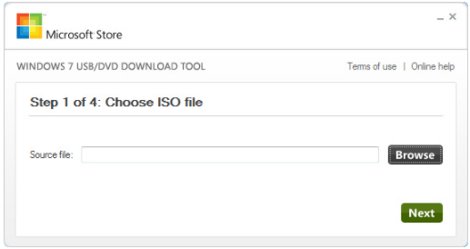

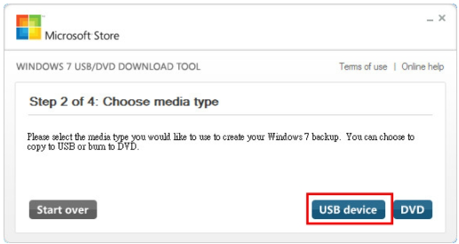

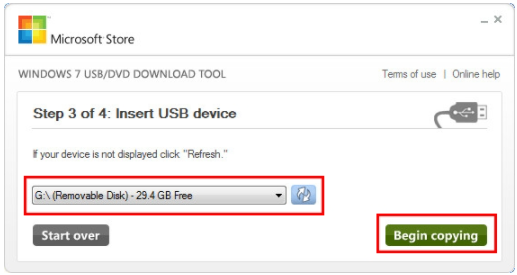

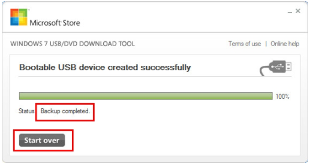

UEFI
^^^^^^^^

現在Windowsのインストールメディアは大体ISOの中にのWIMやESDファイルがメインです。

UEFIのWindowsシステムはWindows 7以後がサポートする、正式的にはWindows 8からサポートする。

Windows 8からは元のWIMフォマットのインストールイメージファイルをESDを変わります。

UEFIのハードウェアはブートメディアに.efiファイルを確認し、そうしてFat32のファイルシステムしか認識できる。

だから、色んな面倒の確認が必要です。

幸い、今は OpenSource の世帯だから、インターネットから色んな便利ツールがあり、こちらで紹介する。

* Windows 8と8.1のお勧め：

方法１、公式サイトから 8.1ISOダウロード_　できます。直接のISOが入手可能です。

　でもこれは絶対最新ヴァージョンでは言えない。

方法２、ESDファイルからのISO作成。ほぼ最新版のメディアが確保可能です。

　ESDのダウロードは `TechBench by WZT (v4.1.1)`_ というサイトが勧めです。

　まずは"type"をESDに選択し、そうして、対応のOSヴァージョンとお好みな言語を選択し、ハードウェアによってx86かx64を選択する。

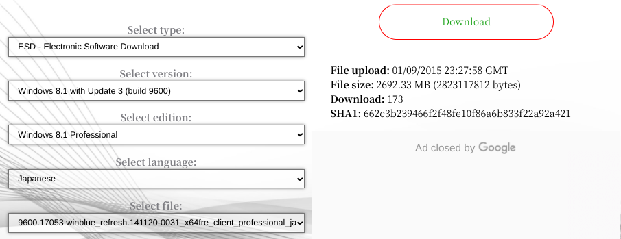

　ESDをダウロードすると、まずはSHA1SUMを確認します。

.. Warning::

    SHA1SUM：ファイルの内容確認の一つ方法です。

    インターネット多発されたファイルはネット通信か偽リンクが可能ので、ファイルをダウロードすると、

    CheckSUMというシステムでファイルの確認がおすすめです。

    最も便利と無料な方法は7-ZIP_を使う、内蔵付属のツールを使って確認できます。

　確認できると、ESDをインストール可能な形式になるにはもう一個変換ツールが必要です。

　それは、`DECRYPT-MULTI-RELEASE`_ というツールがおすすめです。

　DECRYPT-MULTI-RELEASE直接ダウンロード：`DMR直接`_ ここにアクセス可能です。

　ISOを変換の場合は、ダウロードしたツールを解凍する、そうしてESDファイルを同じフォルダに入れる。

　次のように実行すると、ISOが作ります：

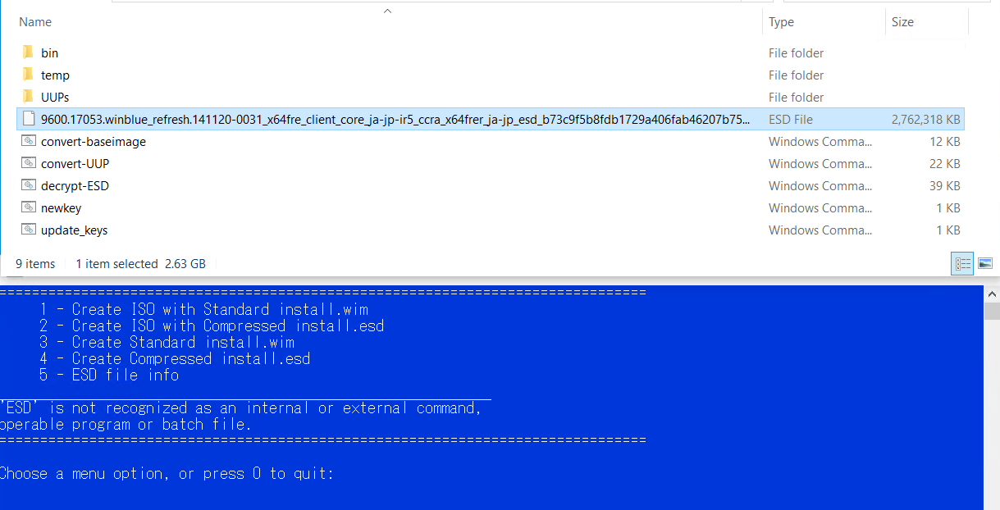

　そうして、作ったISOファイルを最後で RUFUS_ というツールをUSBに書き込みます。

.. image:: https://rufus.ie/pics/rufus_jp.png

* Windows 10の作成方法：

方法１、マイクロソフト公式サイトで `Windows 10 のディスク イメージ (ISO ファイル) のダウンロード`_ 、もしくは

　Windows システムでアクセスの場合、 `Windows 10 Update Assistant`_ でEXEファイルをダウンロードし、公式的にダウロードと作成可能です。

方法２、自力作成。

　他には、最新版のISOが欲しいけど、マイクロソフト社がリリースしていないという悩みがあれば、
　あるグループな人が努力し、開発したのコマンドツールがあります。

　そのツールはマイクロソフト社に直接最新版のアップデートとインストールファイルをダウンロードし、ISOファイルを作成します。

　UUPというツールで名を付けました。

　おすすめのUUPツールは二つのサイトから使用できます：

* UUP dump - https://uupdump.ml/

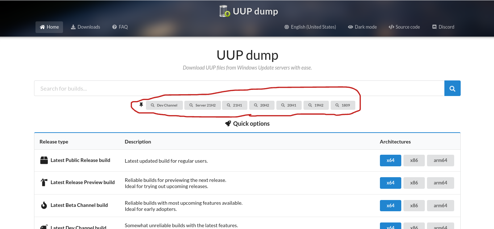

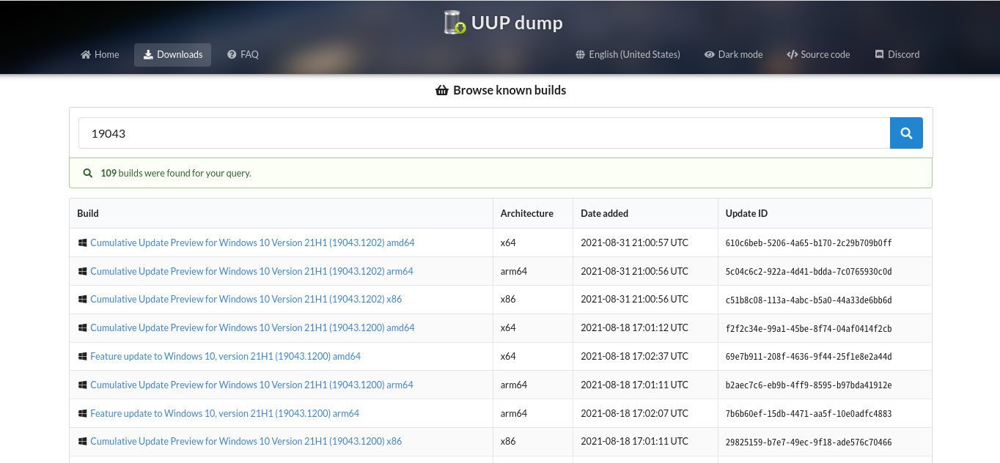

　Buildについては説明いただきます。Cumulative Updateは安全性が優先で、必要な更新をパッチするだけ。

　まだ、Feature updateは、安全性と新しい機能もぱっちする。

　Architectureはハードウェア・CPUによって、最適のを選択する。

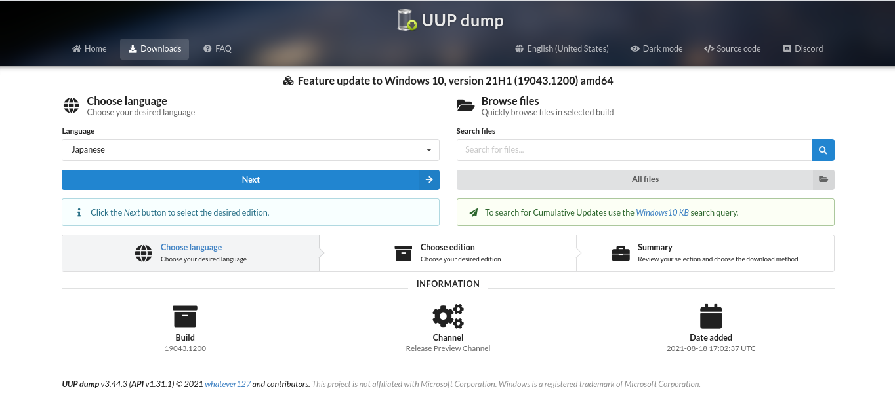

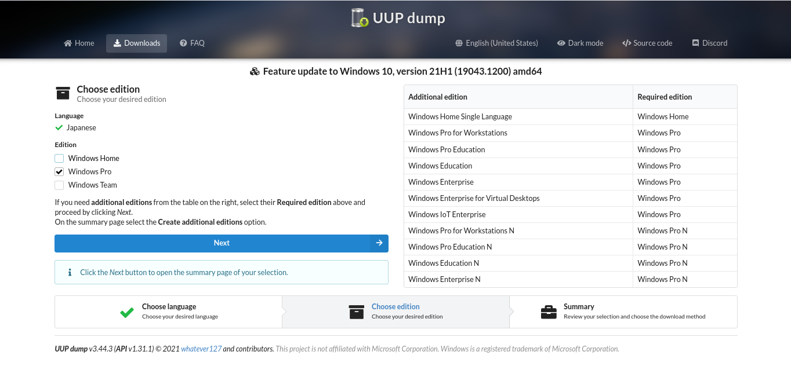

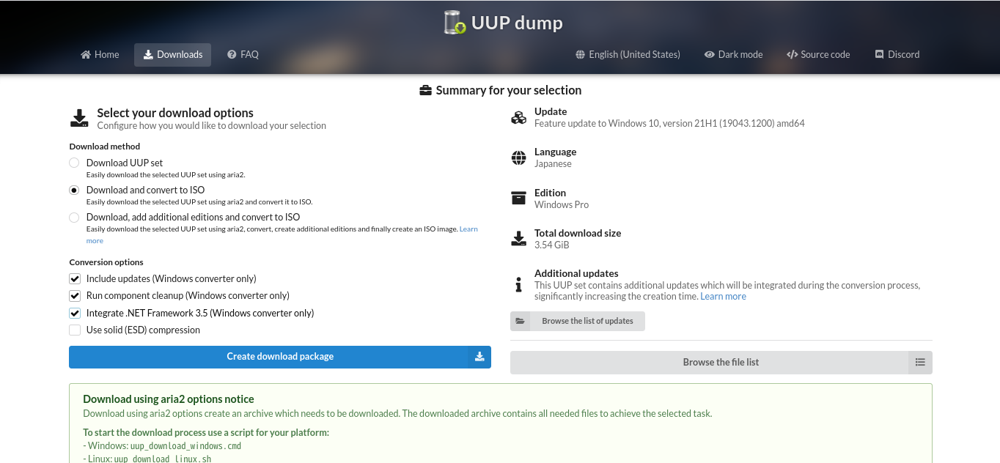

　Conversion optionsについて、Component Cleanupは不必要なゴミをクリーニング、ISOはより小さくなれる。

　.Net Framework 3.5は、Windows 10以後はデフォルト4.5を実装するだけ、これをチェックしたら、この機能を先にインストール可能になる。

　最後はzipファイルをダウンロード、解凍し、スクリプトファイルに実行すると、自動的にダウロードとISOを作成する。

* UUP Generation Project (v2.4.10) [by @rgadguard & whatever127] - https://uup.rg-adguard.net/

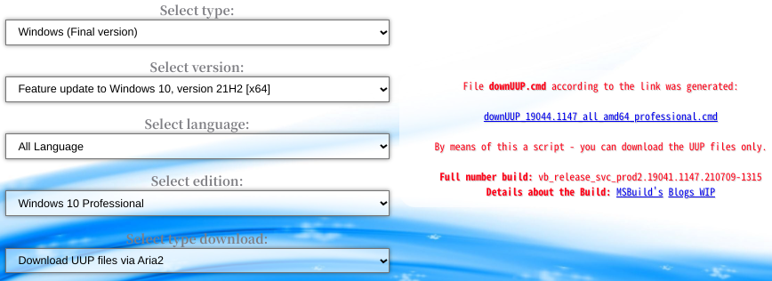

どちらでダウロードしたのISOは、RUFUS_ というツールをUSBに書き込みます。

.. image:: https://rufus.ie/pics/rufus_jp.png

.. warning::

    **ここでは一つ注意点があります**

    完全な UEFI＋Security Boot にはEFI・Fat32のインストールメディアが必要。

    この全ての更新をパッチする場合には、 **install.wim** ファイルが fat32の4G制限を超えす。

    4G以上のinstall.wimにはfat32ファイルシステムに格納できず。
    
    だから、WIMをSWMに分割が必要です。

　分割の方法は以下のスクリプトを実行が必要、そうしてISOファイルを再パッケージが必要です。

.. code-block:: shell

    Dism /Split-Image /ImageFile:install.wim /SWMFile:install.swm /FileSize:4096

システム・ディスク・パーティション
----------------------------------------

伝統型（BIOS）
^^^^^^^^^^^^^^

*形１*

+-------------------+
|  C:¥ (OS files)   |
|      [NTFS]       |
+-------------------+

*形２（おすすめ）*

+---------------------------------+-------------------+
|  System Reserved (Boot Loader)  |  C:¥ (OS files)   |
|      [NTFS]                     |      [NTFS]       |
+---------------------------------+-------------------+

EFI型（UEFI）
^^^^^^^^^^^^^^

*形１*

+---------------------+-------------------+
|  EFI (Boot Loader)  |  C:¥ (OS files)   |
|      [fat32]        |      [NTFS]       |
+---------------------+-------------------+

*形２*

+---------------------+---------------------------+-------------------+
|  EFI (Boot Loader)  | MSR (Project GPT format)  |  C:¥ (OS files)   |
|      [fat32]        |  [MSR]                    |      [NTFS]       |
+---------------------+---------------------------+-------------------+

*形３*

+---------------------+---------------------------+-------------------+--------------------------------+
|  EFI (Boot Loader)  | MSR (Project GPT format)  |  C:¥ (OS files)   | Recovery (回復用OSが入ってる)  |
|      [fat32]        |  [MSR]                    |      [NTFS]       |  [NTFS]                        |
+---------------------+---------------------------+-------------------+--------------------------------+

--------

--------

Linux
============

インターネットにアクセス可能の子供頃、何時か、Microsoft社が開発したWindowsシステムは実際に有料です。

ライセンスの概念は最初にあんまり無かった。それは、ほぼのWindowsシステムはメーカー制作したのハードウェアと共に買いました。

結局はあるときに、いよいよライセンスやシステム利用の料金と言う概念が得た。

それから、「まさか、この世は有料のシステムしかないでしょうか？」という疑問が来たら、実際にネットで検索した。

そうして、Linuxの扉が開いた。初対面のシステムはUbuntu 8.10でした。インターネットで自力勉強とインストールした。

その後、無料より、実際の意味は改めて認識した。 これはOpen Sourceという概念、と開源ライセンスなど。

システムコアとビルド
----------------------

Linux概念：

　自作、組み立て、Openのシステムと、皆（コミュニティー）の力でシステムを作成する。

　一人作るは難しいけど、一緒にならいける。そうして一緒にシステムの検証とテストをやる。

　コアは、 `Linux Kernel`_ を使って、OSの必要な機能を立ち上がる。

便利性と別商売：

　コミュニティーだからこそ、好き嫌いがある。　だから、流派との延長も産めれる。

　最終的には、ソフトウェア管理ツールによって、Distroとビルドで分離した。

　人々は自分の好みに自由で選べる。

* Debain系
* Red Hat系
* Slackware系
* 他（など）
    - Arch Linux
    - FreeBSDコア
    - Android

ダウンロード・Live・とインストールメディア作成
------------------------------------------------

ダウロードには各公式サイトにダウロードする。もしくは UNetBootin_ という便利ツールもあります。

**UNetBootin**

.. image:: https://unetbootin.github.io/screenshot1.jpg

.. image:: https://unetbootin.github.io/screenshot4.jpg

既知Linuxシステム
^^^^^^^^^^^^^^^^^^^

+------------+------------+---------------------------+--------------------------------------------------------------------------------+
| OS名       | ソフト管理 | 公式サイト（英語）        | ダウロードページ                                                               |
+============+============+===========================+================================================================================+
| Ubuntu     | apt        | https://ubuntu.com/       | https://ubuntu.com/download                                                    |
+------------+------------+---------------------------+--------------------------------------------------------------------------------+
| CentOS     | yum        | https://www.centos.org/   | https://www.centos.org/download/                                               |
+------------+------------+---------------------------+--------------------------------------------------------------------------------+
| RedHat     | yum        | https://www.redhat.com/   | https://www.redhat.com/en/technologies/linux-platforms/enterprise-linux/try-it |
+------------+------------+---------------------------+--------------------------------------------------------------------------------+
| Kubuntu    | apt        | https://kubuntu.org/      | https://kubuntu.org/getkubuntu/                                                |
+------------+------------+---------------------------+--------------------------------------------------------------------------------+
| Linux Mint | apt        | https://linuxmint.com/    | https://linuxmint.com/download.php                                             |
+------------+------------+---------------------------+--------------------------------------------------------------------------------+
| Arch Linux | pacman     | https://archlinux.org/    | https://archlinux.org/download/                                                |
+------------+------------+---------------------------+--------------------------------------------------------------------------------+
| Fedora     | dnf        | https://getfedora.org/    | https://getfedora.org/workstation/download/                                    |
+------------+------------+---------------------------+--------------------------------------------------------------------------------+
| openSUSE   | zypper     | https://www.opensuse.org/ | https://get.opensuse.org/                                                      |
+------------+------------+---------------------------+--------------------------------------------------------------------------------+
| FreeBSD    | pkg        | https://www.freebsd.org/  | https://www.freebsd.org/where/                                                 |
+------------+------------+---------------------------+--------------------------------------------------------------------------------+

Windowsシステムの場合は RUFUS_ も勧めです。

同時にLive USBも作成できますし、インストールメディアもできます。

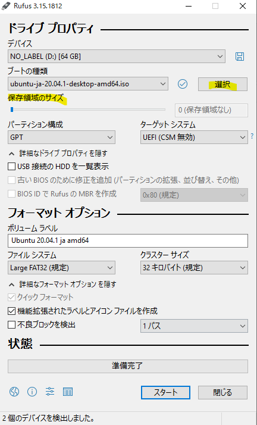

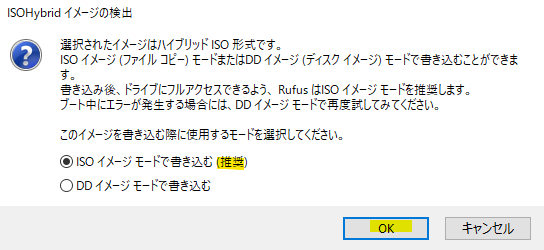

システム・ディスク・パーティション
----------------------------------------

伝統型（BIOS）
^^^^^^^^^^^^^^

**Lagacyの基本型：**

+--------------------------+----------+
|  / (/root)               |  SWAP    |
|      [ext4]              |  [swap]  |
+--------------------------+----------+

**Lagacyの独立型：**

*Type 1*

+---------------+-------------+---------+
|  Boot(/boot)  |  / (/root)  |  SWAP   |
|   [ext4]      |   [ext4]    |  [swap] |
+---------------+-------------+---------+

*Type 2*

+---------------+-------------+---------------+---------+
|  Boot(/boot)  |  / (/root)  |  Home(/home)  |  SWAP   |
|   [ext4]      |    [ext4]   |   [ext4]      |  [swap] |
+---------------+-------------+---------------+---------+

*Type 3*

+---------------+-------------+-------------+---------------+---------+
|  Boot(/boot)  |  / (/root)  |  var(/var)  |  Home(/home)  |  SWAP   |
|    [ext4]     |    [ext4]   |    [ext4]   |   [ext4]      |  [swap] |
+---------------+-------------+-------------+---------------+---------+

*Type 4*

+---------------+-------------+-------------+---------------+--------------+---------+
|  Boot(/boot)  |  / (/root)  |  var(/var)  |  Home(/home)  |  Temp(/tmp)  |  SWAP   |
|    [ext4]     |    [ext4]   |    [ext4]   |   [ext4]      |    [ext4]    |  [swap] |
+---------------+-------------+-------------+---------------+--------------+---------+

EFI型（UEFI）
^^^^^^^^^^^^^^

**UEFIの基本型：**

+-------------+--------------------------+----------+
| EFI (/efi)  |  / (/root)               |  SWAP    |
|   [fat32]   |      [ext4]              |  [swap]  |
+-------------+--------------------------+----------+

**UEFIの独立型：**

*Type 1*

+-------------+---------------+-------------+---------+
| EFI (/efi)  |  Boot(/boot)  |  / (/root)  |  SWAP   |
|   [fat32]   |   [ext4]      |   [ext4]    |  [swap] |
+-------------+---------------+-------------+---------+

*Type 2*

+-------------+---------------+-------------+---------------+---------+
| EFI (/efi)  |  Boot(/boot)  |  / (/root)  |  Home(/home)  |  SWAP   |
|   [fat32]   |   [ext4]      |    [ext4]   |   [ext4]      |  [swap] |
+-------------+---------------+-------------+---------------+---------+

*Type 3*

+-------------+---------------+-------------+-------------+---------------+---------+
| EFI (/efi)  |  Boot(/boot)  |  / (/root)  |  var(/var)  |  Home(/home)  |  SWAP   |
|   [fat32]   |    [ext4]     |    [ext4]   |    [ext4]   |   [ext4]      |  [swap] |
+-------------+---------------+-------------+-------------+---------------+---------+

*Type 4*

+-------------+---------------+-------------+-------------+---------------+--------------+---------+
| EFI (/efi)  |  Boot(/boot)  |  / (/root)  |  var(/var)  |  Home(/home)  |  Temp(/tmp)  |  SWAP   |
|   [fat32]   |    [ext4]     |    [ext4]   |    [ext4]   |   [ext4]      |    [ext4]    |  [swap] |
+-------------+---------------+-------------+-------------+---------------+--------------+---------+

.. warning::

    Linuxでのスワップ（SWAP）空間はメモリ不足の時に臨時用空間。

    基本的には作った方が良いです。

    サイズはメモリサイズの１．５倍にかける。メモリサイズが小さいの場合は最適に2GBがおすすめ。

--------

--------

MacOS・OSX
================

これはアップル( Apple_ )社が開発されたシステムです。

一般状況はアップル制作したのハードウェアしか使える。

MacBookから、iMacとか、パソコン・ラップトップ機械までは使える。

最初のシステムは有料で、今は全て無料になります。

一部のハッカーさんはVMware VirtualMachine向けのプラグインを開発し、VMもインストール出来ることも有った。

ここはちょっとVMのも紹介し、メインは公式方法を使う。

大体のヴァージョン紹介
------------------------

自分が知っていたのマックはOSXとの名前から、コードはLeopardと呼ぶ。

今現在がメインのはMacOSのBig Surです。

+--------------------+---------------+-------------------+
| 名前・ヴァーション | コード名      | リリース日        |
+====================+===============+===================+
| OS X 10.5          | Leopard       | 26 October 2007   |
+--------------------+---------------+-------------------+
| OS X 10.6          | Snow Leopard  | 28 August 2009    |
+--------------------+---------------+-------------------+
| OS X 10.7          | Lion          | 20 July 2011      |
+--------------------+---------------+-------------------+
| OS X 10.8          | Mountain Lion | 25 July 2012      |
+--------------------+---------------+-------------------+
| OS X 10.9          | Mavericks     | 22 October 2013   |
+--------------------+---------------+-------------------+
| OS X 10.10         | Yosemite      | 16 October 2014   |
+--------------------+---------------+-------------------+
| OS X 10.11         | El Capitan    | 30 September 2015 |
+--------------------+---------------+-------------------+
| macOS 10.12        | Sierra        | 20 September 2016 |
+--------------------+---------------+-------------------+
| macOS 10.13        | High Sierra   | 25 September 2017 |
+--------------------+---------------+-------------------+
| macOS 10.14        | Mojave        | 24 September 2018 |
+--------------------+---------------+-------------------+
| macOS 10.15        | Catalina      | 7 October 2019    |
+--------------------+---------------+-------------------+
| macOS 11           | Big Sur       | 12 November 2020  |
+--------------------+---------------+-------------------+

VMware Workstation/Playerツール
^^^^^^^^^^^^^^^^^^^^^^^^^^^^^^^^^

UnlockerというツールはMACシステムをVMに実装可能です。

古いと新しいGitHubレポジトリーでダウロード可能です。

実装方法や内容は自己責任でサイトにご参考ください。

* `theJaxon/unlocker`_ 
* `paolo-projects/unlocker`_

インストールメディアの作成
------------------------------

システムメディアのダウロードは直接アップルストアからで入手可能です。

それからのステップは簡単です、ストアからダウンロードしたとか確認すると、次のコマンドでbootable installerのUSBメディアを作成する。

オフィシャルダウロードサイト_ に参考とダウロードがおすすめです。

*Catalina:*

.. code-block::bash
    
    sudo /Applications/Install\ macOS\ Catalina.app/Contents/Resources/createinstallmedia --volume /Volumes/<Volume名>

*Mojave:*

.. code-block::bash
    
    sudo /Applications/Install\ macOS\ Mojave.app/Contents/Resources/createinstallmedia --volume /Volumes/<Volume名>

*High Sierra:*

.. code-block::bash
    
    sudo /Applications/Install\ macOS\ High\ Sierra.app/Contents/Resources/createinstallmedia --volume /Volumes/<Volume名>

*El Capitan:*

.. code-block::bash
    
    sudo /Applications/Install\ OS\ X\ El\ Capitan.app/Contents/Resources/createinstallmedia --volume /Volumes/<Volume名> --applicationpath /Applications/Install\ OS\ X\ El\ Capitan.app

システム・ディスク・パーティション
----------------------------------------

マックシステムのはとてもシンプルです。アップル社が全てを用意したので、インストールしたいの時は１つのパーティションで大丈夫です。

アップルの内蔵ディスク分割ソフトで大丈夫です。

MACのシステムはGPTがデフォルト。

パーティションの形式はOSの時期によって、HFS+やAPFSがデフォルトでインストールする。

* ハードティースクの構成

+-------------------------------------+
| HFS+ / APFS                         |
+-------------------------------------+

.. _(WUD): https://www.windowsupdatedownloader.com/
.. _Windows USB/DVD Download Tool: https://www.microsoft.com/ja-jp/download/details.aspx?id=564
.. _8.1ISOダウロード: https://www.microsoft.com/software-download/windows8ISO
.. _TechBench by WZT (v4.1.1): https://tb.rg-adguard.net/public.php
.. _7-ZIP: https://www.7-zip.org/download.html
.. _DECRYPT-MULTI-RELEASE: https://rg-adguard.net/decrypt-multi-release/
.. _DMR直接: https://rg-adguard.net/dl-decrypt
.. _RUFUS: https://rufus.ie/
.. _Windows 10 のディスク イメージ (ISO ファイル) のダウンロード: https://www.microsoft.com/software-download/windows10ISO
.. _Windows 10 Update Assistant: https://www.microsoft.com/software-download/windows10
.. _Linux Kernel: https://www.kernel.org/
.. _UNetbootin: https://unetbootin.github.io/
.. _Apple: https://www.apple.com/
.. _オフィシャルダウロードサイト: https://support.apple.com/HT211683
.. _theJaxon/unlocker: https://github.com/theJaxon/unlocker
.. _paolo-projects/unlocker: https://github.com/paolo-projects/unlocker